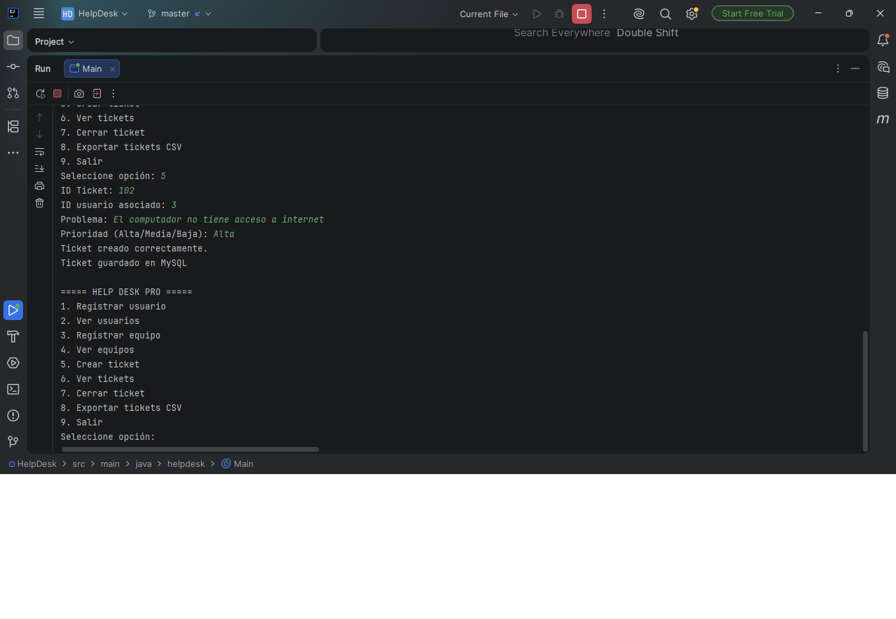
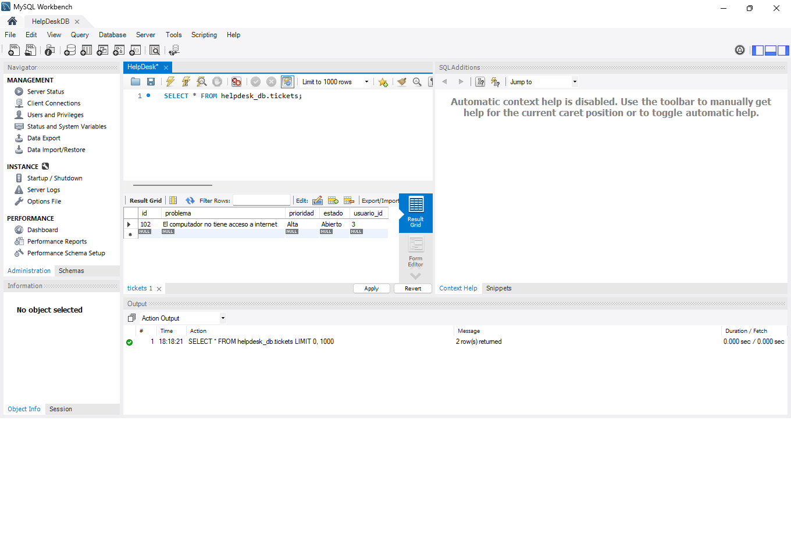

# 💻 HelpDeskPro V1

Sistema de Mesa de Ayuda desarrollado en **Java**, utilizando **Programación Orientada a Objetos (POO)**, **Maven**, **JDBC** y **MySQL**.

El proyecto simula un sistema básico de soporte técnico para la gestión de usuarios, equipos y tickets de incidencias.

---

# 🚀 Funcionalidades

- ✅ Registro de usuarios
- ✅ Registro de equipos
- ✅ Creación de tickets
- ✅ Visualización de usuarios
- ✅ Visualización de equipos
- ✅ Visualización de tickets
- ✅ Cierre de tickets
- ✅ Persistencia de datos en MySQL
- ✅ Exportación de tickets a CSV

---

# 🛠 Tecnologías utilizadas

- Java 23
- Maven
- MySQL
- JDBC
- IntelliJ IDEA
- Git
- GitHub

---

# 📂 Estructura del proyecto

```text
HelpDesk
│
├── src
│   └── main
│       └── java
│
│           ├── helpdesk
│           │      Main.java
│           │
│           ├── model
│           │      Usuario.java
│           │      Equipo.java
│           │      Ticket.java
│           │
│           ├── service
│           │      UsuarioService.java
│           │      UsuarioDBService.java
│           │      EquipoService.java
│           │      EquipoDBService.java
│           │      TicketService.java
│           │      TicketDBService.java
│           │
│           └── util
│                  ConexionBD.java
│                  ArchivoUtil.java
│
├── pom.xml
└── README.md
```

---

# 🗄 Base de datos

El sistema utiliza una base de datos MySQL llamada:

```sql
helpdesk_db
```

Con las siguientes tablas:

- usuarios
- equipos
- tickets

---

# 📸 Capturas del proyecto

## Menú principal

Permite acceder a todas las funcionalidades del sistema de Mesa de Ayuda.


---

## Creación de un ticket

Ejemplo de creación de un ticket de soporte técnico y almacenamiento exitoso en MySQL.



---

## Persistencia en MySQL

Verificación de que el ticket fue almacenado correctamente en la base de datos.



---

# ▶️ Cómo ejecutar el proyecto

1. Clonar el repositorio.

```bash
git clone https://github.com/Sebastian6161/HelpDesk_V1.git
```

2. Crear la base de datos **helpdesk_db** en MySQL.

3. Ejecutar el script de creación de tablas.

4. Configurar el usuario y contraseña en la clase:

```text
ConexionBD.java
```

5. Ejecutar el proyecto desde IntelliJ IDEA o mediante Maven.

---

# 📈 Próximas mejoras

Este proyecto corresponde a la primera versión del sistema.

La siguiente versión (**HelpDeskPro V2**) incorporará:

- Arquitectura Repository Pattern
- Eliminación del almacenamiento CSV
- Persistencia completa en MySQL
- Login de usuarios
- Roles (Administrador y Técnico)
- Dashboard de estadísticas
- JavaFX
- Validaciones avanzadas
- Mejor manejo de excepciones
- Código desacoplado y más mantenible

---

# 👨‍💻 Autor

**Sebastián Ignacio Ávila Sanhueza**

Estudiante de Analista Programador Computacional  
Duoc UC

GitHub:

👉 https://github.com/Sebastian6161

---

# 📌 Estado del proyecto

**Versión:** 1.0

Proyecto funcional desarrollado como parte del aprendizaje de Java, Programación Orientada a Objetos y conexión con bases de datos MySQL mediante JDBC.
